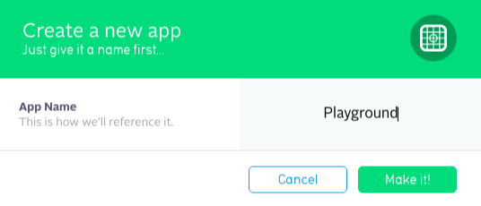
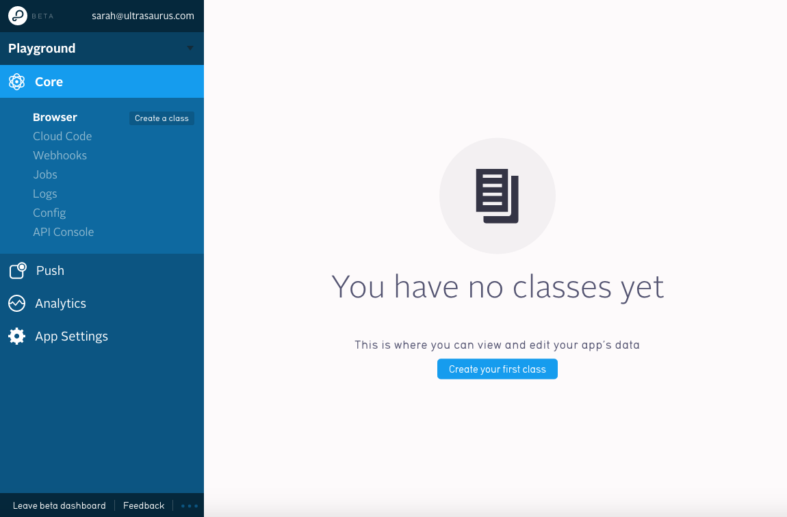
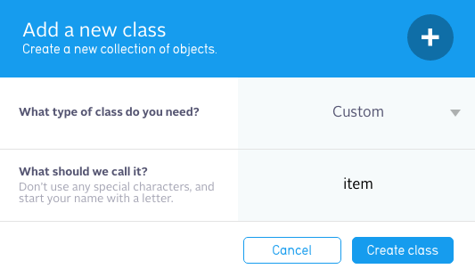
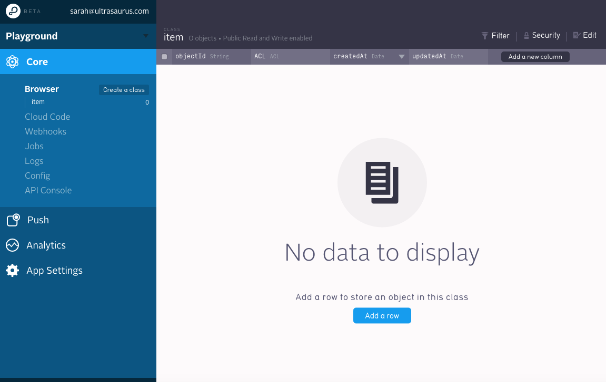
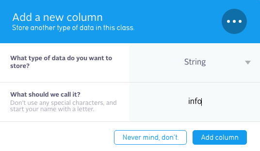

# Parse Playouground

For experimenting with [Parse.com](https://www.parse.com/) in Swift

Tested with:
* OSX 10.10.5 (Yosemite)
* Xcode 7.2
* Ruby 2.2.4
* Cocoapod 0.39.0

# Set up Parse

Make an app in Parse, after creating an account, create an app:



Then you should see something like this:


Add a class called "item"


Then you will see the empty list of objects:


Add a column called "info"


then add a few objects

# Play with XCode and Swift

download the files from this repo

in XCode, open `ParsePlayground.xcworkspace`

in `experiment.playground`

find the following two lines of code and fill in your app ID and client key from parse

```
Parse.setApplicationId("-redacted-",
  clientKey: "-redacted-")
```
